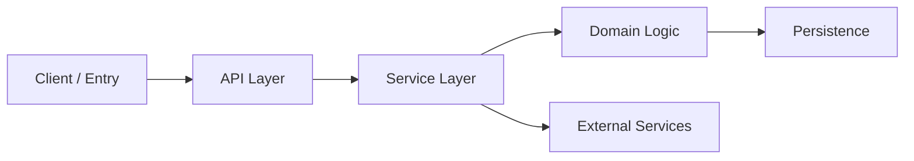

# Codebase Reference Vault Templates

Use these templates as the default output format for `codebase-reference-vault`.

## 1. Project Overview

Suggested path: `<vault_root>/00-Overview/project-overview.md`

```md
# Project Overview

## Snapshot
- Project name:
- Primary language(s):
- Framework/runtime:
- Package/build system:
- Main entry points:

## What This System Does

## Repository Shape
- `path/`:
- `path/`:
- `path/`:

## Core Areas
- [[Architecture Overview]]
- [[Module Map]]
- [[Flow Index]]
- [[Architecture Graph]]
- [[Primary Request Flow]]
- [[Config And Commands]]
- [[Debug Reference]]

## Reading Order
1. 
2. 
3. 

## Open Questions
- 
```

## 2. Module Map

Suggested path: `<vault_root>/00-Overview/module-map.md`

```md
# Module Map

## Core Modules
- [[Module: API]]
- [[Module: Service Layer]]
- [[Module: Persistence]]

## Boundaries
- inbound:
- domain:
- outbound:

## Central Hubs
- 

## Peripheral Areas
- 

## Related Notes
- [[Project Overview]]
- [[Architecture Overview]]
- [[Architecture Graph]]
- [[Flow Index]]
```

## 3. Flow Index

Suggested path: `<vault_root>/00-Overview/flow-index.md`

```md
# Flow Index

## Primary Flows
- [[Flow: Primary Request]]
- [[Flow: Startup]]
- [[Flow: Background Job]]

## Notes
- 

## Related Notes
- [[Project Overview]]
- [[Module Map]]
- [[Architecture Graph]]
```

## 4. Architecture Overview

Suggested path: `<vault_root>/01-Architecture/architecture-overview.md`

```md
# Architecture Overview

## High-Level Structure

## Main Layers
- interface layer:
- application/business layer:
- data/integration layer:

## Entry Points
- file:
- command:
- service:

## Boundaries
- internal boundary:
- external boundary:

## Key Dependencies
- dependency:
- dependency:

## Related Notes
- [[Project Overview]]
- [[Module Map]]
- [[Flow Index]]
- [[Primary Request Flow]]
```

## 5. Architecture Graph

Suggested path: `<vault_root>/01-Architecture/architecture-graph.md`

````md
# Architecture Graph



## Notes
- 

## Related Notes
- [[Project Overview]]
- [[Module Map]]
- [[Architecture Overview]]
````

## 6. Module Note

Suggested path: `<vault_root>/02-Modules/module-<name>.md`

```md
# Module: Name

## Purpose

## Key Paths
- `path/to/module`
- `path/to/file`

## Main Interfaces
- symbol:
- symbol:

## Internal Responsibilities
- 

## Dependencies
- depends on:
- used by:

## Graph Links
- upstream modules:
- downstream modules:
- related flows:

## Important Files
- `path/to/file`: why it matters
- `path/to/file`: why it matters

## Reading Notes
- 

## Related Notes
- [[Architecture Overview]]
- [[Module Map]]
- [[Primary Request Flow]]
- [[Config And Commands]]
```

## 7. Flow Note

Suggested path: `<vault_root>/03-Flows/flow-<name>.md`

```md
# Flow: Name

## Trigger

## Entry Point
- file:
- symbol:

## Step-by-Step Path
1. 
2. 
3. 

## State Changes / Side Effects
- 

## Key Modules
- [[Module: A]]
- [[Module: B]]

## Crossed Boundaries
- 

## Entry And Exit
- enters through:
- exits through:

## Failure Points
- 

## Related Notes
- [[Flow Index]]
- [[Architecture Overview]]
- [[Debug Reference]]
```

## 8. Config And Commands

Suggested path: `<vault_root>/04-Config-And-Commands/config-and-commands.md`

```md
# Config And Commands

## Important Config Files
- `path/to/config`:
- `path/to/config`:

## Important Environment Variables
- `ENV_NAME`:
- `ENV_NAME`:

## Common Commands
- install:
- dev:
- build:
- test:
- lint:

## Notes
- 

## Related Notes
- [[Project Overview]]
- [[Module Map]]
- [[Debug Reference]]
```

## 9. Debug Reference

Suggested path: `<vault_root>/05-Debug-Reference/debug-reference.md`

```md
# Debug Reference

## Good Starting Points
- file:
- command:
- log source:

## Common Failure Areas
- 

## Traces To Follow
- request trace:
- startup trace:
- background job trace:

## Useful Commands
- 

## Related Notes
- [[Architecture Overview]]
- [[Module Map]]
- [[Primary Request Flow]]
- [[Config And Commands]]
```
